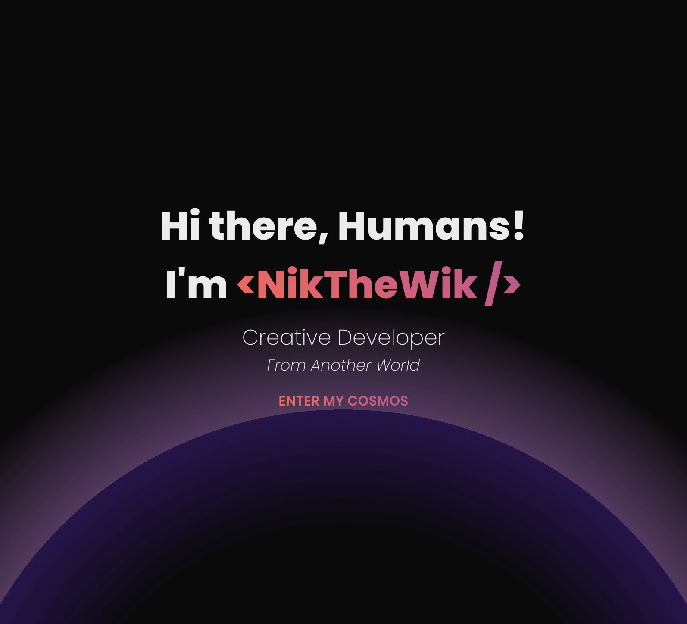

# Portfolio

This is my portfolio site to show my skills and projects as a developer.

## Tables of Contents

- [Overview](#overview)
  - [Technologies used](#technologies-used)
  - [Link](#link)
- [Author](#author)
- [License](#license)

## Overview

### Technologies used

- Vite
- TypeScript
- React
- React Icons
- React Router
- React Responsive
- React Helmet
- Redux Toolkit
- Framer Motion
- Fontsource
- Simplebar React
- JSX
- CSS Modules
- Flexbox
- Responsive design
- Mobile-first workflow

### Link

- Portfolio - [Click here](https://nikthewik.netlify.app/)

## Author

- GitHub - [nikthewik](https://github.com/nikthewik)
- LinkedIn - [in/nikthewik](https://linkedin.com/in/nikthewik)

## License

Distributed under the MIT License. See `LICENSE.txt` for more information.
